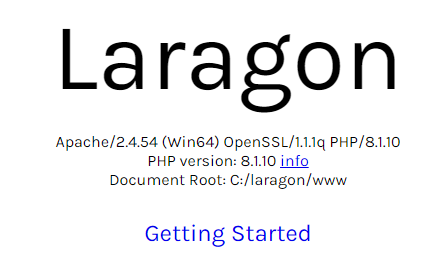

# 02 ¿Que se NECESITA para PROGRAMAR en PHP (WINDOWS)

## Insalacion
1. Descarar Laragon desde la pagina oficial
2. Seleccionar version FULL
3. Seleccionar Idioma
4. Elegir ubicacion
5. Desmarcar las 3 opciones
6. Reiniciar la PC una vez que se instale

## Programa 
Es ultra intuitivo, le damos a inciar para que se encienda

### Corroborar que esta encendido
* En el navegador buscamos `localhost`

### phpMyAdmin
* En el navegador buscamos `localhost/phpmyadmin`
* Para ingresar lo hacemos con:
    
    user = **root**
    password = (vacio no lleva)

### Cambiar version de php
1. Ir a https://windows.php.net/download/
2. Buscar la ultima version
3. Seleccionar la que dice **Non Thread Safe**
4. Descargar en .ZIP
5. Descomprimir el .ZIP
6. Guardar la carpeta en 'laragon/bin/php' a la par de la otra carpeta de version
7. En la app de laragon, click derecho > php > version
8. Seleccionar la version
9. Nos va a dar un error
10. En la misma web, descargamos VC16 & VS17
11. Lo ejecutamos
12. Reiniciar servidor
