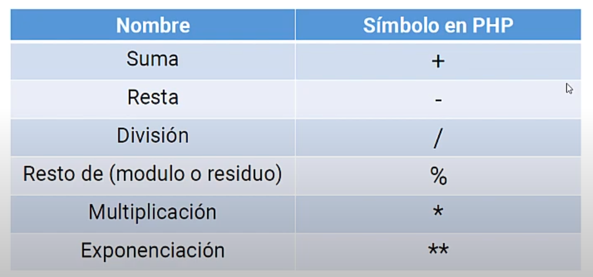
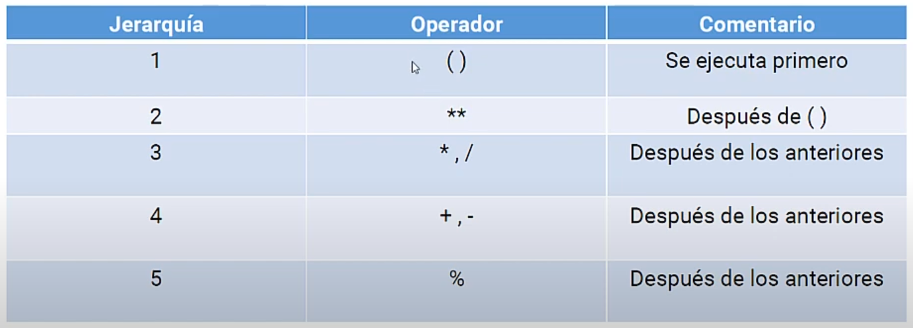

# 10 OPERADORES ARITMETICOS (MATEMATICOS) en PHP
## Simbologia



### Suma
```php
<?php
    $num1 = 5;
    $num2 = 3;

    echo $num1 + $num2;
```

### Resta
```php
<?php
    $num1 = 5;
    $num2 = 3;

    echo $num1 - $num2;
```

### Division
```php
<?php
    $num1 = 5;
    $num2 = 3;

    echo $num1 / $num2;
```

### Multiplicacion
```php
<?php
    $num1 = 5;
    $num2 = 3;

    echo $num1 * $num2;
```

### Exponenciacion
```php
<?php
    $num1 = 5;
    $num2 = 3;

    echo $num1 ** $num2;
```

### Modulo-Resto-Residuo
```php
<?php
    $num1 = 5;
    $num2 = 3;

    echo $num1 %    $num2;
```


## Jerarquia
Esta es la jerarquia con la que se realizaran las operacionees aritmeticas en PHP

