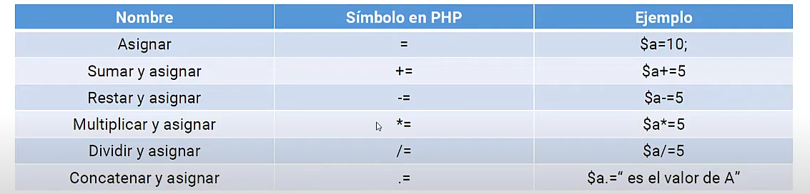

# 11 OPERADORES de ASIGNACION en PHP


## Asignar
Se utiliza para asignarle/reemplazarle el valor a una variable
```php
=
```
## Sumar y asignar
Se utiliza para sumarle a una variable

```php
$num1 = 5;
$num1+=5; 
/*Nos mostraria 10, pq la var ya guarda 5 y se le suma y guardan 5 mas*/
```

Es lo 

## Restar y asignar

```php
$numero2 = 5;
$numero2 -= 2;

    echo $numero2;
```
## Multiplicar y asignar 

```php
$numero3 = 5;
$numero3 *= 2;

    echo $numero3;    
```
## Dividir y asignar

```php
$numero4 = 5;
$numero4 /= 2;

    echo $numero4;    
```
## Concatemar y asignar
```php
$texto_inicial = 'Texto inicial';
$texto_inicial.= ' texto agregado'; 

echo $texto_inicial;
```