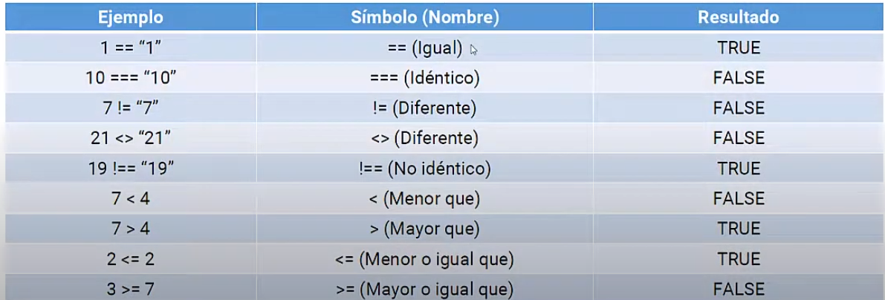

# 13 OPERADORES de COMPARACION en PHP 

Comparan dos valores y devuelven boolean (TRUE - FALSE)

## Ver si es true or false

```php
<?php
var_dump(1=="1");
```

## == (Igual)
No discrimina tipo de dato, solamente valor
```php
<?php
    var_dump(1==1);
```

## === (Identico)
Si discrimina tipo de datos
```php
<?php
    var_dump(1==1);
```
## != (Diferente)
No discrimina tipo de dato, solamente valor
```php
<?php
    var_dump(1!=1);
```
## <> (Diferente)
No discrimina tipo de dato, solamente valor
```php
<?php
    var_dump(1<>1);
```
## !== (No identico)
Si discrimina tipo de datos
```php
<?php
    var_dump(1!==1);
```
## < (Menor que)
```php
<?php
    var_dump(1<2);
```
## > (Mayor que)
```php
<?php
    var_dump(1>43);
```
## <= (Menor o igual que)
 ```php
<?php
    var_dump(1<=2);
```
## >= (Mayor o igual que)   
```php
<?php
    var_dump(1>=1);
```