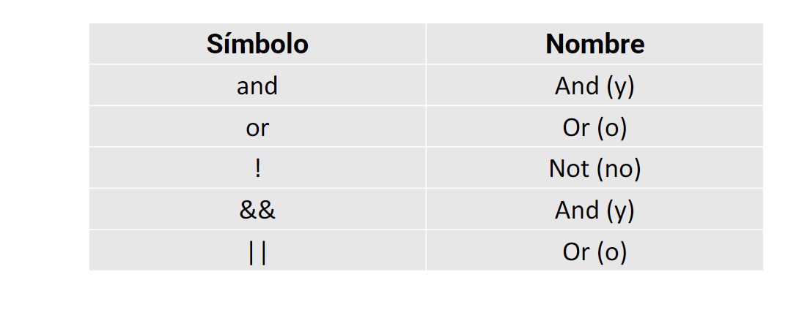

# 14 OPERADORES LOGICOS en PHP 
Son operadores que evaluan condiciones y devuelven valores booleanos 
 

## AND 
Deben cumplirse ambas condiciones

```php
var_dump(1===1 && 2===2);
```


## OR
Debe cumplirse alguna de las condiciones
```php
var_dump(1===1 || 2===2);
```


## NOT (negado)
Devuelve el valor contrario a la expresion
```php
var_dump(!(1===1)); /*Debe estar entre parentesis lo que se niegue*/
```
