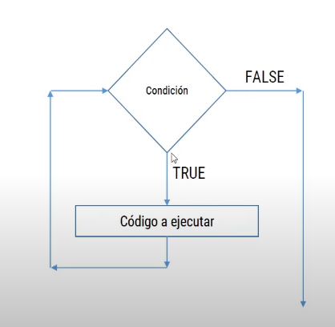

# 27 Como USAR el CICLO WHILE en PHP (EJEMPLOS)
## IMPORTANTE => Salto de linea
```."<br>"```

## DFD


### En el ciclo while, mientras la condicion sea verdadera el ciclo se repite, cuando pasa a ser falsa, el ciclo se detiene. Llevara un contador para saber hasta donde debe seguir.

## Sintaxis
```php
    #Solo PHP
    while(condicion){
        codigo_a_ejecutar
    }
```
```php
    #PHP + HTML5
    while(condicion):
        codigo_a_ejecutar
    endwhile;
```

## Ejemplos

### 1. Diseñe un programa que imprima los números del 1 hasta el 20. (Incremento y decremento).

```php
#Del 1 al 20
<?php
    $c = 1;
    while($c <= 20){
        echo $c."<br>";
        $c++;
    }
```

```php
#Del 20 al 1
<?php
    $c = 20;
    while($c >= 0){
        echo $c."<br>";
        $c--;
    }
```

### 2.Diseñe un programa que imprima la tabla de multiplicar de un numero dado, desde el factor 1 hasta el 12. (Incremento y decremento).
```php
<?php
#Del 1 al 12
    $c = 1;
    $numMult = 5;
    while($c<=12){
        echo $c * $numMult.'<br>';
        $c ++;  
    }
```

```php
<?php
#Del 12 al 1
    $c = 12;
    $numMult = 5;
    while($c>=1){
        echo $c * $numMult.'<br>';
        $c --;  
    }
```