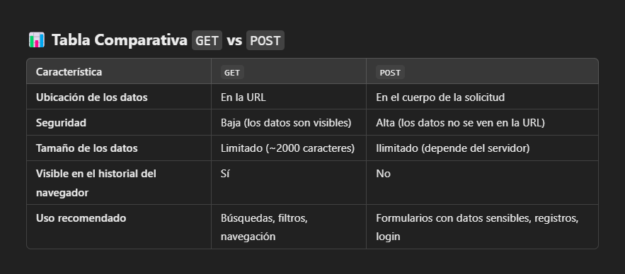

# 43 ENVIAR FORMULARIOS con METODO GET & POST en PHP (DIFERENCIAS)


## Formulario
```html
<!DOCTYPE html>
<html lang="en">
<head>
    <meta charset="UTF-8">
    <meta name="viewport" content="width=device-width, initial-scale=1.0">
    <title>Document</title>
</head>
<body>

    <form action="index.php" method="POST">
        <div>
            <label for="nombre">Nombre</label>
            <input type="text" id='nombre' name='nombre'>
        </div>

        <br>

        <label for="asignatura">Asignatura</label>
        <select name="asignatura" id="asignatura">
            <option value="Ingles">Ingles</option>
            <option value="Matematica">Matematica</option>
            <option value="Ciencia">Ciencia</option>
            <option value="Lenguaje">Lenguaje</option>
        </select>

        <br><br>
    
        <label for="opcion-1">
            <input type="checkbox" value='Manzana' id='opcion-1' name='frutas'>
            Manzana
        </label>
    
        <br><br><br>
    
        <button type='submit'>Enviar</button>
    </form>

</body>
</html>
```
En la etiqueta de  `form`, puedo elegir si sera `method='GET'` o `method='POST'`


## index.php utilizando POST
```php
<?php
$nombre = $_POST['nombre'];
$asignatura = $_POST['asignatura'];
$fruta = $_POST['frutas'];

echo $nombre.' - '.$asignatura.' - '.$fruta;

```
Utilizando $_POST relacionamos los datos del formulario a PHP. Generalmente se guardan en una variable con el fin de poder manejarlos de manera sencilla.


## index.php utilizando GET
```php
<?php
$nombre = $GET['nombre'];
$asignatura = $GET['asignatura'];
$fruta = $GET['frutas'];

echo $nombre.' - '.$asignatura.' - '.$fruta;
```